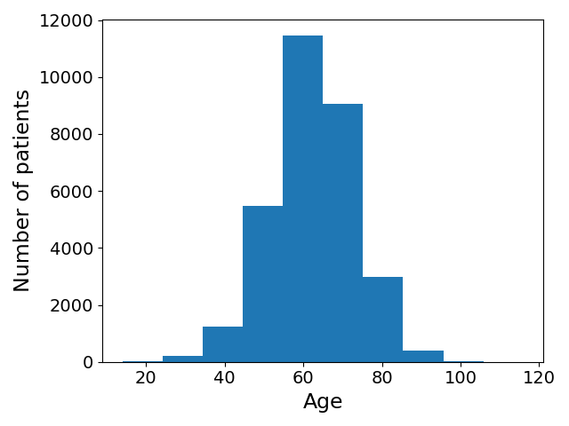
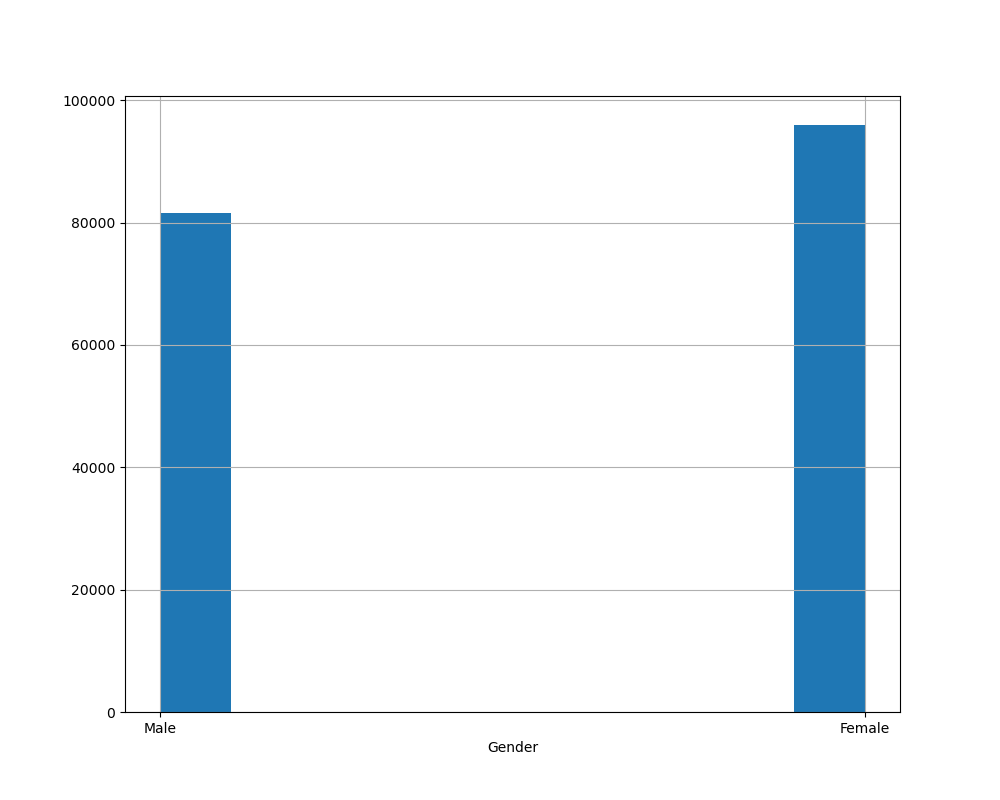
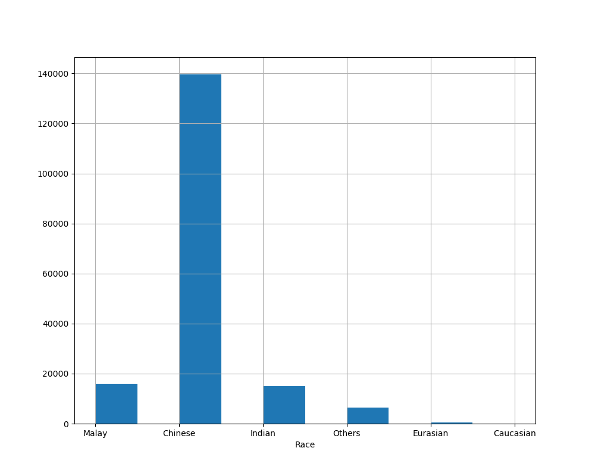
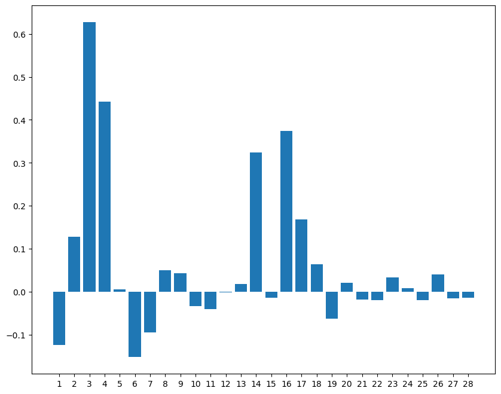
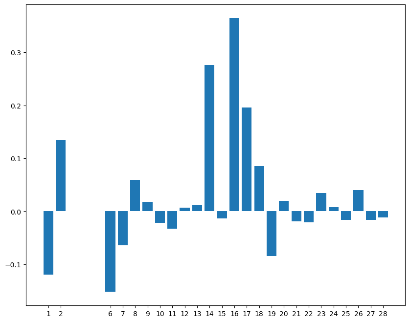
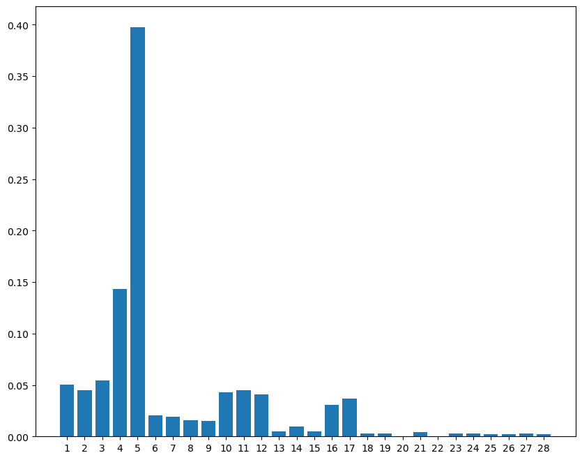
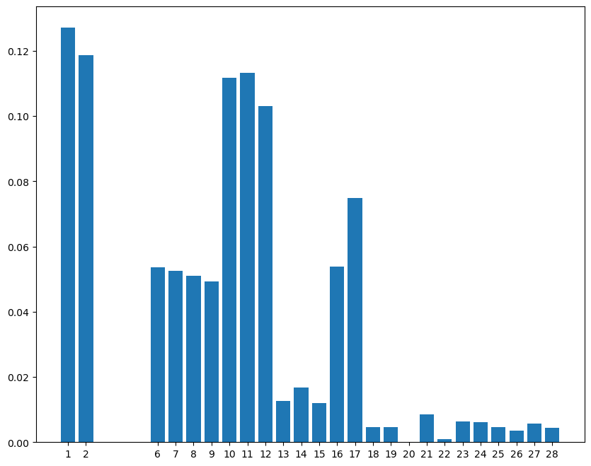

# diabetes prediction
Analysis on the AISG healthcare data. 

## 1 Raw data understanding
### 1.1 pre-diabetes/diabetes patients

| pre-diabetes ONLY | pre-diabetes to diabetes | diabetes ONLY | nonDiabetes |
|-------------------|--------------------------|---------------|-------------|
| 13779             | 8563                     | 79342         | 123397      |

### 1.2 Data distribution by Age, Gender, Ethnicity

  
   
  

## 2 Missing data analysis
| index | feature                   | missing % of all data | missing distribution by pre-dia/diabetes (%) |
|-------|---------------------------|-----------------------|----------------------------------------------|
| 1     | Age                       |                       |                                              |
| 2     | Weight_kg                 | 21.85                 |                                              |
| 3     | OGTT2hr_(mmol/l)          | 87.82                 | 55.62 / 44.38                                |
| 4     | FPG_(mmol/l               | 70.07                 | 66.55 / 33.45                                |
| 5     | HbA1c_%                   | 53.07                 | 15.40 / **84.60**                            |
| 6     | LDLc_(mmol/l)             | 54.96                 |                                              |
| 7     | TC_(mmol/l)               | 54.65                 |                                              |
| 8     | TG_(mmol/l)               | 54.65                 |                                              |
| 9     | HDLc_(mmol/l)             | 54.66                 |                                              |
| 10    | BMI_kg/m2                 | 21.84                 |                                              |
| 11    | SBP_mmHg                  | 4.64                  |                                              |
| 12    | DBP_mmHg                  | 4.64                  |                                              |
| 13    | Hypertension (Y/N)        |                       |                                              |
| 14    | Dyslipidaemia (Y/N)       |                       |                                              |
| 15    | Surgical_procedure (Y/N)  |                       |                                              |
| 16    | No_of_complications       |                       |                                              |
| 17    | Counts_of_visits          |                       |                                              |
| 18    | Gender_Female             |                       |                                              |
| 19    | Gender_Male               |                       |                                              |
| 20    | Race_Caucasian            |                       |                                              |
| 21    | Race_Chinese              |                       |                                              |
| 22    | Race_Eurasian             |                       |                                              |
| 23    | Race_Indian               |                       |                                              |
| 24    | Race_Malay                |                       |                                              |
| 25    | Race_Others               |                       |                                              |
| 26    | Smoking_Status_Ex-Smoker  |                       |                                              |
| 27    | Smoking_Status_Non-Smoker |                       |                                              |
| 28    | Smoking_Status_Smoker     |                       |                                              |

## 3 Preliminary Results on feature importance analysis
- Logistic Regression with and without feature 345 

  
  
  

- Random Forest with and without feature 345 

  
  

## 4 Preliminary Results on diabetes prediction
### SVM
|                                            | Accuracy % |
|--------------------------------------------|------------|
| diagnosis_records_3000                     | 73.91      |
| diagnosis_records_gender_filling           | 77.05      |
| diagnosis_records_knn10_gender_age_filling | 69.02      |
### kNN
|                                            | Accuracy % |
|--------------------------------------------|------------|
| diagnosis_records_3000                     | 68.9       |
| diagnosis_records_gender_filling           | 74.9       |
| diagnosis_records_knn10_gender_age_filling | 67.86      |

### Logistic Regression
|                                              | Accuracy % | Accuracy % (remove 345) | Accuracy % (remove 5) |
|----------------------------------------------|------------|-------------------------|-----------------------|
| diagnosis_records_3000                       | 68.56      |                         |                       |
| diagnosis_records_gender_filling             | 64.41      |                         |                       |
| diagnosis_records_knn10_gender_age_filling   | 62.18      |                         |                       |
| diagnosis_records_knn100_gender_age_filling  | 62.94      |                         |                       |
| diagnosis_records_knn1000_gender_age_filling | 64.29      | 60.39                   | 64.24                 |
| diagnosis_records_gender_age_race_filling    | 64.67      | 60.54                   | 64.45                 |
| diagnosis_records_zero_filling               | 88.44      | 60.31                   | 74.33                 |

### Random Forest
|                                              | Accuracy % | Accuracy % (remove 345) | Accuracy % (remove 5) |
|----------------------------------------------|------------|-------------------------|-----------------------|
| diagnosis_records_3000                       | 69.23      |                         |                       |
| diagnosis_records_gender_filling             | 88.94      |                         |                       |
| diagnosis_records_knn10_gender_age_filling   | 84.1       |                         |                       |
| diagnosis_records_knn100_gender_age_filling  | 85.75      |                         |                       |
| diagnosis_records_knn1000_gender_age_filling | 86.34      | 59.29                   |  72.24                |
| diagnosis_records_gender_age_race_filling    | 87.15      | 65.57                   |  75.82                |
| diagnosis_records_zero_filling               | 88.79      | 65.89                   |  76.01                |

### RNN
|                                              | Accuracy % | Accuracy % (remove 345) |
|----------------------------------------------|------------|-------------------------|
| diagnosis_records_3000                       | 65.72      |                         |
| diagnosis_records_gender_filling             | 84.08      |                         |
| diagnosis_records_knn10_gender_age_filling   | 69.67      |                         |
| diagnosis_records_knn100_gender_age_filling  | 77.13      |                         |
| diagnosis_records_knn1000_gender_age_filling | 82.97      |                         |
| diagnosis_records_gender_age_race_filling    | 85.61      | 61.24                   |
| diagnosis_records_zero_filling               | 88.75      | 61.66                   |
### LSTM
|                                              | Accuracy % | Accuracy % (remove 345) |
|----------------------------------------------|------------|-------------------------|
| diagnosis_records_3000                       | 63.88      |                         |
| diagnosis_records_gender_filling             | 82.86      |                         |
| diagnosis_records_knn10_gender_age_filling   | 67.64      |                         |
| diagnosis_records_knn100_gender_age_filling  | 76.48      |                         |
| diagnosis_records_knn1000_gender_age_filling | 83.01      |                         |
| diagnosis_records_gender_age_race_filling    | 85.35      | 60.75                   |
| diagnosis_records_zero_filling               | 88.6       | 60.64                   |
### GRU
|                                              | Accuracy % |
|----------------------------------------------|------------|
| diagnosis_records_3000                       | 66.89      |
| diagnosis_records_gender_filling             | 82.79      |
| diagnosis_records_knn10_gender_age_filling   | 68.25      |
| diagnosis_records_knn100_gender_age_filling  | 76.36      |
| diagnosis_records_knn1000_gender_age_filling | 83.19      |
| diagnosis_records_gender_age_race_filling    | 84.88      |

## 5 Preliminary Results on ethnic-aware transfer learning

### Accuracy results
- source: Race_Chinese; target: Race_Malay, Race_Indian

#### Logistic Regression
|                                              | Malay | Indian |
|----------------------------------------------|-------|--------|
| diagnosis_records_knn1000_gender_age_filling | 65.93 | 62.69  |
| diagnosis_records_gender_age_race_filling    | 65.25 | 62.17  |
| diagnosis_records_zero_filling               | 87.80 | 87.10  |
#### Random Forest
|                                              | Malay | Indian |
|----------------------------------------------|-------|--------|
| diagnosis_records_knn1000_gender_age_filling | 84.73 | 83.59  |
| diagnosis_records_gender_age_race_filling    | 88.19 | 87.25  |
| diagnosis_records_zero_filling               | 88.42 | 87.64  |
#### LSTM
|                                              | Malay | Indian |
|----------------------------------------------|-------|--------|
| diagnosis_records_knn1000_gender_age_filling | 81.14 | 78.61  |
| diagnosis_records_gender_age_race_filling    | 82.44 | 78.74  |
| diagnosis_records_zero_filling               | 88.22 | 87.16  |
